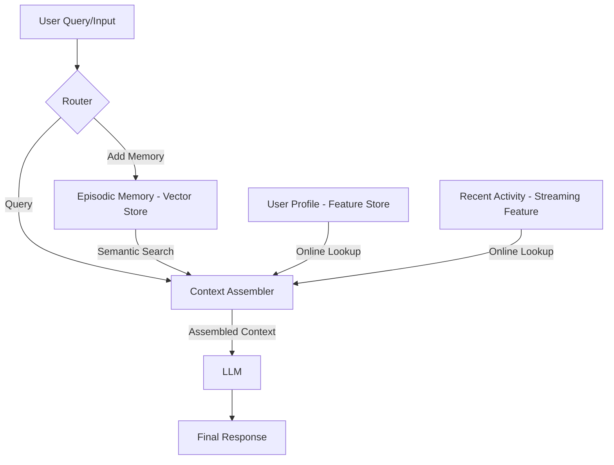

# Personal AI Memory Architecture

## Sơ đồ kiến trúc

## Các Quyết Định Kiến Trúc

### Quyết định 1: Chunking Strategy cho Episodic Memory
- **Lựa chọn:** Chunking theo cấp độ semantic break (ý nghĩa), giới hạn 512 tokens mỗi chunk, thay vì chunk theo từng tin nhắn (per-message) hay theo từng toàn bộ cuộc hội thoại (per-conversation).
- **Tradeoff:** Semantic break chunking giúp giữ được trọn vẹn một ý nên nâng cao Retrieval Quality. Tuy nhiên, nó phức tạp hơn khi parse so với per-message và tốn Storage Cost lớn hơn do có thể phải thêm overlap giữa các chunk. Tuy nhiên, đánh đổi này xứng đáng vì giúp LLM có bối cảnh tốt hơn so với per-message (có thể bị rời rạc) hoặc per-conversation (có thể vượt quá context window).

### Quyết định 2: Feature Schema cho User Profile
- **Lựa chọn:** Sử dụng kết hợp Tabular Features (ví dụ: `reading_speed_wpm`, `preferred_language`) và categorical affinity (`topic_affinity`).
- **Tradeoff:** Sử dụng dạng bảng và danh mục rõ ràng giúp việc truy vấn (Online Lookup) trên Feature Store nhanh chóng, dễ dàng caching, debug và update. Nếu sử dụng embedding features cho latent preferences, nó có thể capture được những preferences phức tạp hơn, nhưng làm hệ thống đen (black-box), khó kiểm soát vì sao AI đưa ra gợi ý, đồng thời tốn tài nguyên tính toán để sinh ra và duy trì. Do đó ưu tiên tabular cho User Profile.

### Quyết định 3: Freshness Strategy (Tần suất cập nhật)
- **Lựa chọn:** Sử dụng sub-second streaming (Push API) cho Recent Activity (`queries_last_hour`) và daily batch refresh cho Stable User Profile (`topic_affinity`).
- **Tradeoff:** Đối với những sự kiện gần đây (như query trong 1 giờ), việc dùng Push API đảm bảo độ trễ thấp và phản ánh ngay lập tức (freshness) những gì user vừa quan tâm. Tuy nhiên nó tốn kém tài nguyên streaming. Đối với sở thích dài hạn (topic_affinity), việc cập nhật bằng daily batch refresh tiết kiệm chi phí tính toán (compute cost) mà không ảnh hưởng tới trải nghiệm vì sở thích cốt lõi không đổi liên tục.

## Vietnamese-context Awareness
- **Cân nhắc ngôn ngữ và Tokenization:** Trong ngữ cảnh người Việt thường xuyên dùng "code-switching" (trộn lẫn Tiếng Anh và Tiếng Việt, ví dụ: "tư vấn cho mình plan cloud security"), quyết định quan trọng là sử dụng embedding model có hỗ trợ multilingual tốt (như `bge-m3` hoặc text-embedding-3-large), đồng thời profile `preferred_language` cần có trạng thái `mix` thay vì chỉ `vi` hoặc `en`. Việc này đảm bảo vector store không bị nhiễu do khác biệt ngôn ngữ, và prompt cho LLM cũng uyển chuyển hơn theo văn phong của user.

## Lựa chọn bị từ chối
- **Từ chối lưu Episodic Memory như một Embedding Feature View trong Feature Store:** Tôi đã xem xét việc đồng bộ toàn bộ Episodic Memory vào Feature Store để chỉ dùng một DB duy nhất. Tuy nhiên, tôi chọn tách riêng Episodic vào Vector Store (Qdrant). Lý do là vì re-index cycle (chu kỳ cập nhật) của hai loại này khác hẳn nhau: Episodic memory cần cập nhật streaming liên tục theo phút/giờ và yêu cầu tính năng Approximate Nearest Neighbor (ANN) search phức tạp, trong khi Feature Store tối ưu hoá cho low-latency key-value lookup theo entity_id. Việc ép Vector vào Feature Store có thể gây bottle-neck và overhead không đáng có.

## Hạn chế của POC (What this POC doesn't handle yet)
- **Multi-user privacy isolation:** POC này chưa phân tách quyền truy cập dữ liệu giữa nhiều user. Trong thực tế, cần thêm payload filtering theo `user_id` ở cấp độ Vector DB (Qdrant) và isolation level cho Feature Store.
- **Memory decay / Forgetting:** Chưa cấu hình TTL cho Episodic memory. Thực tế những đoạn hội thoại không quan trọng sau 30-90 ngày nên được lưu trữ nén lại hoặc xoá bỏ để tiết kiệm dung lượng.
